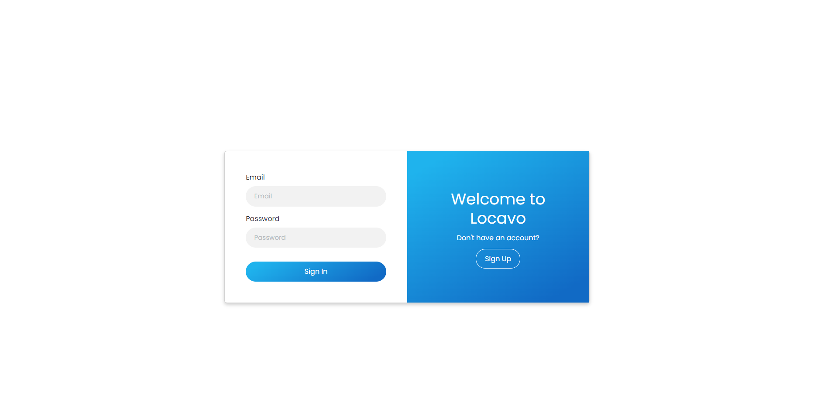
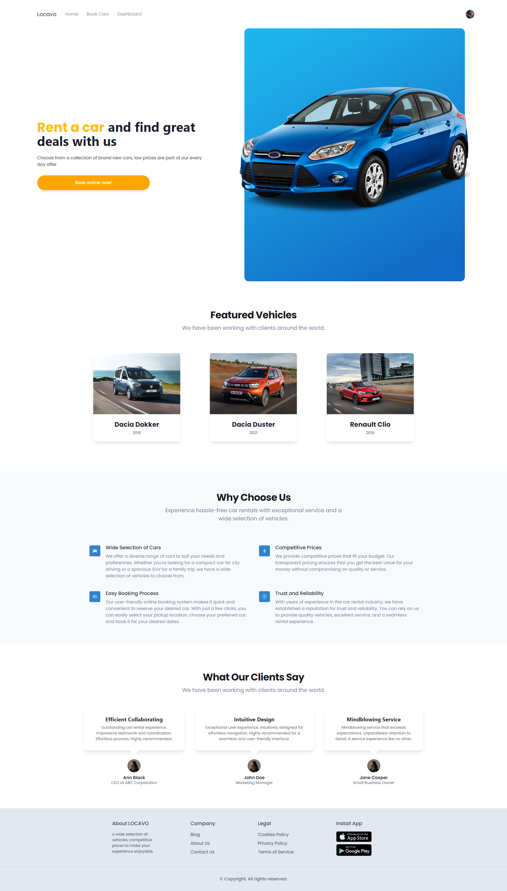
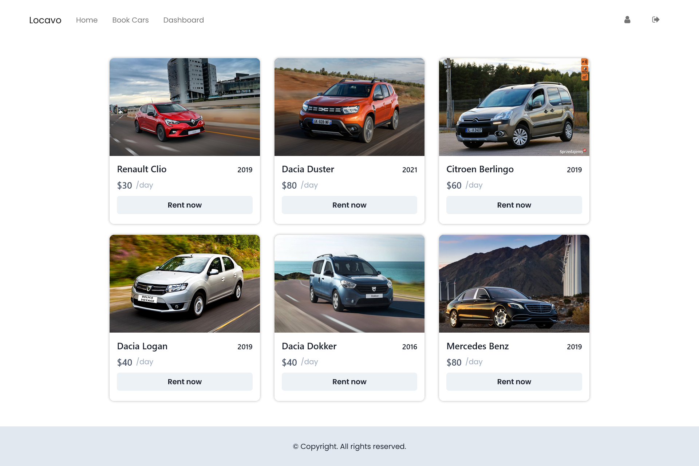
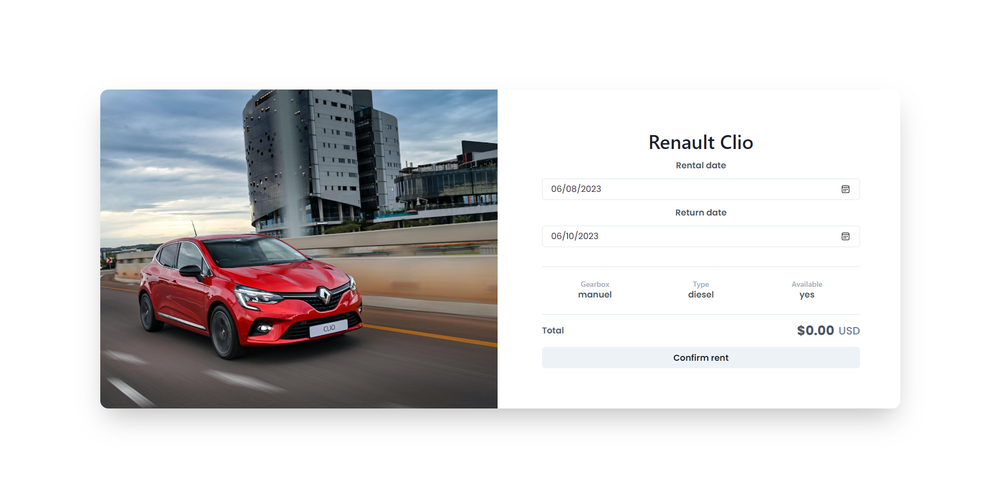
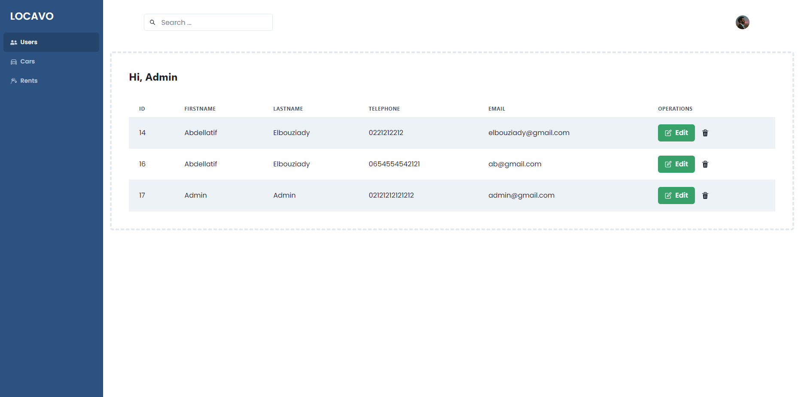
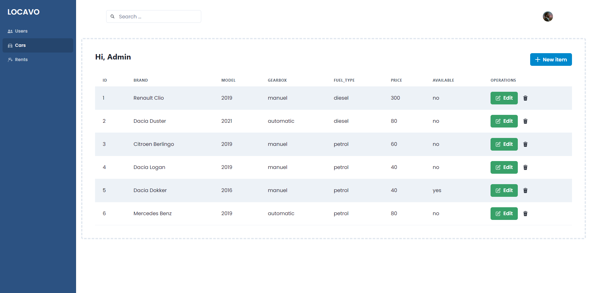
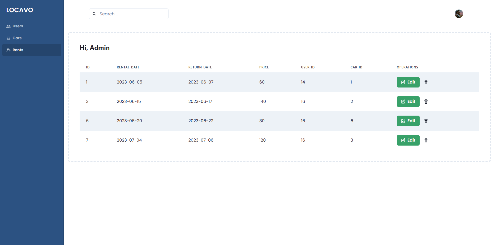
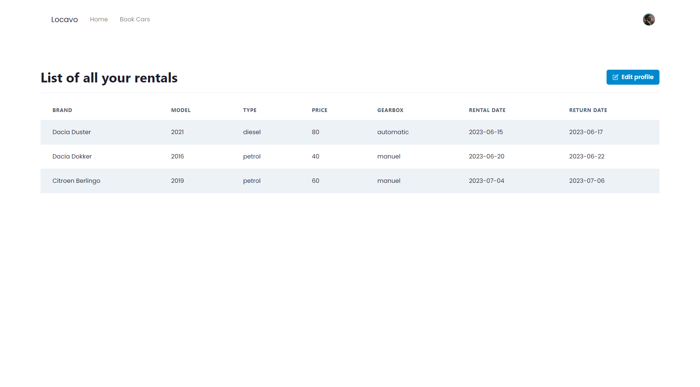

<br/><br/><br/>

<br/><br/><br/>

<br/><br/><br/>
















# Running LOCAVO
Follow these steps to set up and run LOCAVO on your local machine:

## 1. Import the Database
1- In PHPMyAdmin, create a new database.

2- Import the SQL file from the Database folder into the newly created database.

## 2. Start Frontend
1- Open a terminal.

2- Navigate to the Frontend folder of the project.

3- Run the following commands:
```bash
npm install
npm start
```
4- Open your web browser and go to http://localhost:3000 to view the frontend.

## 3. Start Backend
1- Open another terminal.

2- Navigate to the Backend folder of the project.

3- Install backend dependencies:
```bash
composer install
```
4- Start the backend server:
```bash
php artisan serve
```
